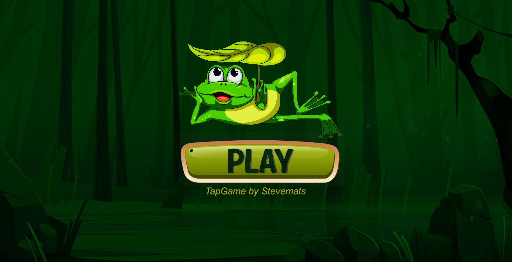

# TapGame

Welcome to [**TapGame**](https://github.com/stevemats/TapGame), a 2D frog-themed game developed using Unity and C#.



## Overview

In **TapGame**, your objective is to tap on frogs as they appear on the screen. Each successful tap generates a satisfying splash effect and earns you points. The game offers various functionalities, including the ability to pause and resume the game, mute and unmute the sound effects, and keep track of your score.

## Features

- **Frog Tapping**: Tap on the frogs to make them splash.
- **Pause and Resume**: Pause and resume the game at any time.
- **Sound Effects**: Toggle sound effects on and off.
- **Scoring**: Keep track of your score as you play.

---

---

## Getting Started

To play [**TapGame**](https://github.com/stevemats/TapGame), you'll need Unity installed on your computer. Simply clone the repository, open it in Unity, and build the game for your desired platform.

```Python
git clone https://github.com/stevemats/TapGame
```

## Acknowledgments

- [Unity](https://unity.com/): The game engine used to develop **TapGame**.
- [OpenGameArt](https://opengameart.org/): Source of some of assets used in the game.
- [Sentry Blog](https://blog.sentry.io/unity-tutorial-developing-your-first-unity-game-part-1/): Developing your r first unityy game.

\_
